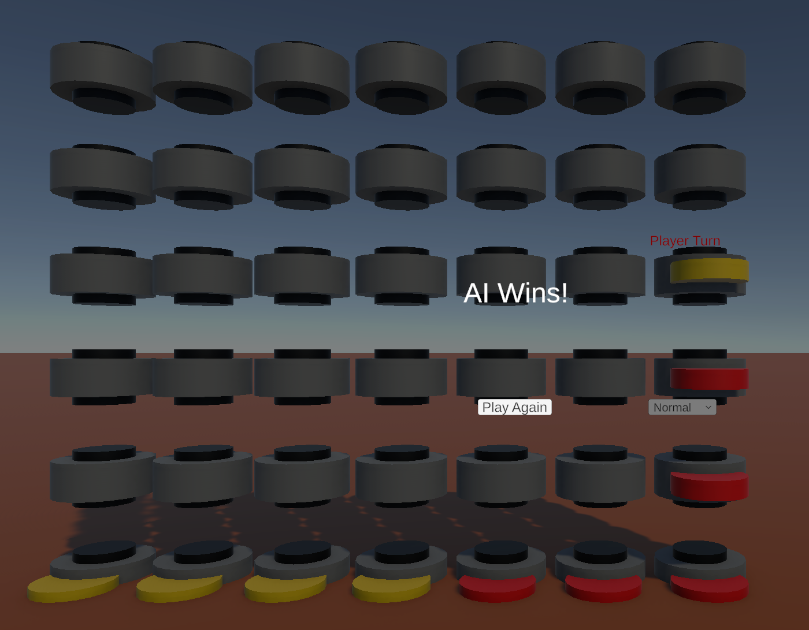

# 🎮 Unity Connect Four with AI
**C++에서 C# 포팅 - AI 게임 알고리즘 시각화**

[](https://unity.com/)
[](https://docs.microsoft.com/en-us/dotnet/csharp/)
[](LICENSE)

> 🎯 **포트폴리오 프로젝트**: C++ 게임 알고리즘을 완전한 3D Unity 게임으로 포팅하여 빠른 C# 학습 능력과 Unity 통합 스킬을 증명하는 프로젝트입니다.



## 📖 프로젝트 개요

이 프로젝트는 기존의 [C++ Game AI Search Algorithms](https://github.com/ahfmrptEkd/game_ai_search_algorithms)를 완전한 Unity 3D 게임으로 포팅하여 **신속한 기술 적응 및 학습 능력**을 보여주기 위한 프로젝트였습니다.

**개발 배경:**
- **출발점**: C++ 콘솔 기반 AI 알고리즘
- **목표**: 완전한 UI/UX를 갖춘 Unity 3D 인터랙티브 게임
- **개발 기간**: 학습 민첩성을 증명하기 위한 신속한 MVP 개발
- **목적**: C# 숙련도와 Unity 통합 역량 증명

## ✨ 주요 성과

### 🚀 **빠른 기술 전환**
- 복잡한 C++ 알고리즘(Random, Alpha-Beta, MCTS)을 C#로 성공적 포팅
- Unity 프레임워크 학습 및 3D 시각화 통합 구현
- 처음부터 완전한 게임 아키텍처 설계 및 구현

### 🎮 **완성된 게임 구현**
- **3단계 AI 난이도**: Easy → Normal → Hard 점진적 증가
- **3D 시각화**: 물리 기반 디스크 낙하 및 부드러운 애니메이션
- **완전한 UI/UX**: 턴 표시기, 게임 오버 화면, 일시정지 기능
- **오디오 통합**: 향상된 플레이어 경험을 위한 사운드 이펙트

### 🏗️ **소프트웨어 아키텍처 우수성**
- **명확한 분리**: Unity와 독립적인 핵심 게임 로직
- **디자인 패턴**: Factory, Singleton, Strategy 패턴 활용
- **모듈러 구조**: 확장 및 유지보수가 용이한 설계
- **Unity 모범 사례**: 적절한 컴포넌트 아키텍처 준수

## 🎯 게임 기능

### 핵심 게임플레이
- **플레이어 vs AI**: 지능적인 상대와의 인터랙티브 Connect Four
- **3단계 난이도**: 
  - 🟢 **Easy**: 랜덤 알고리즘
  - 🟡 **Normal**: Alpha-Beta 가지치기
  - 🔴 **Hard**: 몬테카를로 트리 탐색 (MCTS)
- **실시간 피드백**: 시각적 턴 표시기와 게임 상태 표시

### 기술적 특징
- **3D 보드 시각화**: 적절한 간격의 동적 보드 생성
- **물리 통합**: 중력을 적용한 현실적인 디스크 낙하
- **부드러운 애니메이션**: 완성도를 위한 Ease-out 애니메이션 곡선
- **오디오 시스템**: 게임 액션에 대한 사운드 이펙트
- **UI/UX 완성도**: 게임 오버 처리, 일시정지 메뉴, 난이도 선택

### 사용자 경험
- **직관적 조작**: 클릭하여 플레이하는 인터페이스
- **시각적 피드백**: 플레이어 턴 색상 구분 (빨강/노랑)
- **게임 관리**: ESC 일시정지, 다시하기, 종료 옵션
- **반응형 디자인**: 모든 상호작용에 대한 즉각적 피드백

## 🏗️ 아키텍처 개요

```
UnityAlgorithms/
├── Assets/Scripts/
│   ├── Core/                 # 순수 C# 게임 로직 (Unity 독립적)
│   │   ├── GameState.cs      # 게임 상태 추상 기본 클래스
│   │   ├── ConnectFourState.cs # Connect Four 전용 게임 로직
│   │   └── GameConstants.cs   # 게임 설정 상수
│   │
│   ├── Algorithms/           # AI 알고리즘 구현체들
│   │   ├── Core/            # 알고리즘 인터페이스 및 팩토리
│   │   ├── RandomAlgorithm.cs    # Easy 난이도
│   │   ├── NormalAlgorithm.cs    # Alpha-Beta 가지치기
│   │   └── HardAlgorithm.cs      # MCTS 구현
│   │
│   └── Unity/               # Unity 전용 컴포넌트들
│       ├── GameManager.cs    # 게임 상태 관리 및 UI 조정
│       ├── BoardManager.cs   # 3D 보드 시각화 및 상호작용
│       ├── AudioManager.cs   # 싱글톤 오디오 시스템
│       └── DropdownConnector.cs # UI 컴포넌트 커넥터
```

## 🤖 AI 알고리즘 상세

### Easy (랜덤 알고리즘)
- **전략**: 유효한 수 중 랜덤 선택
- **사용 목적**: 초보자 친화적, 빠른 응답
- **구현**: 단순한 난수 생성

### Normal (Alpha-Beta 가지치기)
- **전략**: Alpha-Beta 최적화가 적용된 미니맥스
- **사용 목적**: 전략적 깊이가 있는 중급 도전
- **구현**: 효율성을 위한 가지치기가 적용된 트리 탐색

### Hard (몬테카를로 트리 탐색)
- **전략**: 시뮬레이션 기반 통계 분석
- **사용 목적**: 인간과 같은 직관을 가진 고급 AI
- **구현**: 랜덤 롤아웃을 통한 UCB1 선택

## 🚀 시작하기

### 필수 조건
- Unity 2022.3 LTS 이상
- Unity 에디터 기본 지식

### 설치 방법
1. **저장소 클론**
   ```bash
   git clone https://github.com/ahfmrptEkd/unity.git
   cd unity
   ```

2. **Unity에서 열기**
   - Unity Hub 실행
   - "열기" 클릭 → 프로젝트 폴더 선택
   - Unity가 모든 에셋을 자동으로 가져옴

3. **게임 오브젝트 설정**
   - 보드 셀과 게임 디스크용 프리팹 생성
   - Inspector에서 GameManager 구성
   - 사운드 이펙트와 AudioManager 연결
   - 게임 오버 및 일시정지 메뉴용 UI 패널 설정

4. **플레이**
   - Unity 에디터에서 Play 버튼 누르기
   - 컬럼을 클릭하여 디스크 떨어뜨리기
   - 드롭다운으로 AI 난이도 변경
   - ESC로 일시정지, Play Again으로 재시작

## 🎮 게임 방법

1. **게임 시작**: Unity에서 Play를 누르거나 빌드된 실행 파일 실행
2. **난이도 선택**: 드롭다운에서 Easy, Normal, Hard 중 선택
3. **수 두기**: 컬럼을 클릭하여 빨간 디스크 떨어뜨리기
4. **AI 응답**: AI가 자동으로 노란 디스크로 수를 둠
5. **승리 조건**: 가로, 세로, 대각선으로 4개 디스크 연결
6. **게임 조작**:
   - **ESC**: 게임 일시정지/재개
   - **Play Again**: 새 게임 시작
   - **Quit**: 애플리케이션 종료

## 📊 개발 지표

| 지표 | 성과 |
|------|------|
| **코드 라인 수** | ~1,000+ 라인의 C# |
| **개발 시간** | 빠른 MVP 반복 개발 |
| **아키텍처 패턴** | 4개 이상의 디자인 패턴 구현 |
| **AI 알고리즘** | 3가지 다른 전략 포팅 |
| **Unity 통합** | UI/오디오가 포함된 완전한 3D 게임 |

## 🎯 학습 성과

### 증명된 기술 역량
- **C# 숙련도**: 복잡한 알고리즘 구현 및 OOP 원칙 적용
- **Unity 숙달**: 3D 게임 개발, 물리, UI, 오디오 시스템
- **소프트웨어 아키텍처**: 클린 코드 원칙과 디자인 패턴
- **빠른 학습**: C++에서 Unity/C# 생태계로의 신속한 적응

### 포트폴리오 가치
- **다양성**: 여러 프로그래밍 언어와 프레임워크에서 작업할 수 있는 능력
- **문제 해결**: 복잡한 알고리즘 구현 및 통합
- **사용자 경험**: 컨셉부터 완성된 제품까지 완전한 게임 개발
- **전문 개발**: 업계 표준 도구 및 관례 준수

## 🔧 기술 사양

- **엔진**: Unity 2022.3 LTS
- **언어**: C# 11.0
- **아키텍처**: 관심사의 명확한 분리가 있는 컴포넌트 기반
- **패턴**: Factory, Singleton, Strategy, Template Method
- **오디오**: 사운드 이펙트가 포함된 Unity AudioSource
- **물리**: Rigidbody 기반 디스크 움직임
- **UI**: TextMeshPro 통합 Unity UI

## 🚀 향후 개선 사항

- [ ] 멀티플레이어 지원 (로컬/온라인)
- [ ] 설정 가능한 매개변수를 가진 고급 AI 난이도
- [ ] 여러 게임이 있는 토너먼트 모드
- [ ] 통계 추적 및 분석
- [ ] 커스텀 보드 테마 및 시각 효과

## Check하면 좋을 포트폴리오

**GitHub**: [ahfmrptEkd](https://github.com/ahfmrptEkd)  
**원본 C++ 프로젝트**: [Game AI Search Algorithms](https://github.com/ahfmrptEkd/game_ai_search_algorithms)

---

## 📝 프로젝트 의의

이 프로젝트는 단순한 게임 구현 이상의 의미를 가집니다. 현대 소프트웨어 개발에 필수적인 **빠른 학습 능력**과 **기술 적응 스킬**을 보여줍니다. 복잡한 알고리즘을 C++에서 Unity/C#로 성공적으로 포팅함으로써 다음 역량을 증명했습니다:

- **시간 제약 하에서 새로운 기술을 빠르게 습득**
- **여러 시스템(3D 그래픽, 물리, AI, 오디오, UI)을 일관성 있게 통합**
- **사용자 경험에 주의를 기울인 완성도 높은 제품 제공**
- **다양한 플랫폼과 언어에 걸쳐 소프트웨어 엔지니어링 원칙 적용**

---